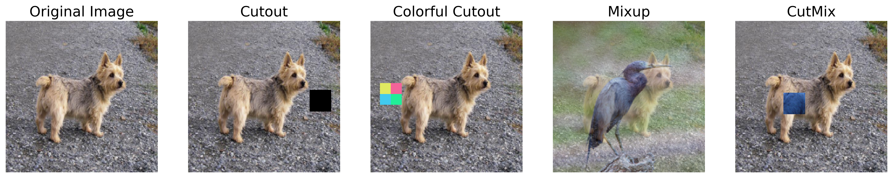
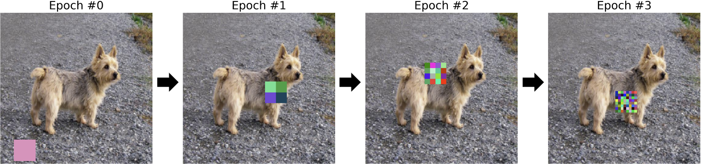

# [ICLR 2024 Tiny Papers] Colorful Cutout: Enhancing Image Data Augmentation with Curriculum Learning

## Introduction

This repository contains the source code for the paper ["Colorful Cutout: Enhancing Image Data Augmentation with Curriculum Learning"](https://openreview.net/pdf?id=mTF4OcDnSP) accepted at ICLR 2024 Tiny Papers. We propose a new data augmentation method called Colorful Cutout, which enhances the performance of image classification models by applying Cutout with a random color mask. We also introduce a curriculum learning strategy to gradually increase the difficulty of the augmentation task, which further improves the performance of the model. Please refer to the paper for more details.




## Experiment

```shell
$ conda create -n proj-colorful python=3.8
$ conda activate proj-colorful
$ pip install torch==1.13.1+cu116 torchvision==0.14.1+cu116 torchaudio==0.13.1 --extra-index-url https://download.pytorch.org/whl/cu116
$ pip install -r requirements.txt
$ bash run_experiment.sh
```

## Citation

If you found this work helpful for your future research, please consider citing this work:

```bibtex
@inproceedings{choi2024gpts,
  title={GPTs Are Multilingual Annotators for Sequence Generation Tasks},
  author={Choi, Juhwan and Lee, Eunju and Jin, Kyohoon and Kim, Youngbin},
  booktitle={Findings of the Association for Computational Linguistics: EACL 2024},
  pages={17--40},
  year={2024}
}
```
